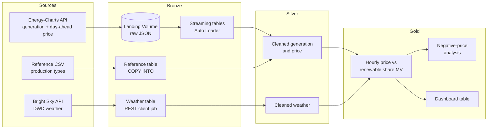

# DE Power Price Lakehouse

> How do wind, solar, and weather drive German day-ahead electricity prices, and when do prices go negative?

An end-to-end data engineering project on the Databricks Data Intelligence Platform. It ingests public German power market and weather data, models it in a medallion architecture (bronze, silver, gold), and serves analytics-ready tables. Infrastructure is managed with **Terraform**, and pipelines, jobs, and environments are deployed with **Declarative Automation Bundles** (formerly Databricks Asset Bundles) and **GitHub Actions**.

<!-- TODO: add a hero screenshot of the final dashboard -->
<!--  -->

**Status:** 🚧 In progress. See the [roadmap](#roadmap) for what is done.

---

## Why this project

Germany's electricity price is driven by a simple mechanism with surprising consequences. Wind and solar cost almost nothing to run, so when they produce a lot, they push the day-ahead price down, sometimes below zero. Price spikes and negative-price hours are directly relevant to energy traders, grid operators, and anyone with flexible demand (batteries, EV charging, industry).

This project builds the data foundation to explore that relationship:

- **What share of generation comes from renewables in each hour, and how does that relate to the price?**
- **How often, and under which weather conditions, do negative prices occur?**
- **How do wind lulls and cloudy periods show up in prices?**

It is also a deliberate exercise in production-style practices on a small, free-to-run footprint: infrastructure as code, environment promotion, data quality checks, governed access, and CI/CD.

## Architecture



<!-- TODO: replace with the final diagram once the pipeline is built -->

### Design in one paragraph

Raw API responses land as JSON files in a Unity Catalog Volume, which Auto Loader ingests incrementally into bronze streaming tables. Weather is pulled by a scheduled job using a REST client. Silver tables clean, type, and deduplicate the data and enforce quality expectations. Gold materialized views join generation, price, and weather on the hour. A Lakeflow Job orchestrates extraction and the pipeline with retries, branching, and a file-arrival trigger.

## Tech stack

| Layer | Tools |
|---|---|
| Platform | Databricks (Free Edition, serverless), Unity Catalog, Delta Lake |
| Ingestion | Auto Loader, `COPY INTO`, Python REST clients |
| Transformation | PySpark / SQL, Lakeflow Spark Declarative Pipelines (streaming tables, materialized views) |
| Orchestration | Lakeflow Jobs (task graph, retries, conditional tasks, file-arrival trigger) |
| Infrastructure as code | Terraform (`databricks/databricks` provider) |
| Deployment | Declarative Automation Bundles, Databricks CLI |
| CI/CD | GitHub Actions (`bundle validate`, `bundle deploy`, `pytest`) |
| Governance | Unity Catalog grants, row filters, column masks |

## Data sources

| Source | Content | Access |
|---|---|---|
| [Energy-Charts API](https://api.energy-charts.info/) (Fraunhofer ISE) | Electricity generation by production type; day-ahead spot price for the DE-LU bidding zone | Public REST, no key |
| [Bright Sky](https://brightsky.dev/) | Hourly weather from Germany's national weather service (DWD) | Public REST, no key |

**Attribution and licensing:** <!-- TODO: verify the current license terms of the Energy-Charts price data and DWD's terms of use, then state them here exactly. -->

**Scope:** the project pulls a limited date range (a few months) to stay within Free Edition compute limits.

## Infrastructure

Terraform owns the stable foundations, and the bundle owns everything that changes with code.

| Managed by Terraform | Managed by the bundle |
|---|---|
| Schemas (`bronze`, `silver`, `gold`) per environment | Lakeflow Jobs |
| Landing Volumes | Declarative pipeline |
| Grants | Notebooks, SQL, dashboard |
| | Dev / prod targets and variables |

**Environments:** `dev` and `prod` are separated by schema prefix (e.g. `dev_bronze`, `prod_bronze`) inside a single catalog. Free Edition uses managed Default Storage, which does not allow creating catalogs through the API. In a real setup I would use a catalog per environment. See [docs/decisions.md](docs/decisions.md).

## Repository structure

```
.
├── databricks.yml          # bundle root: targets and variables
├── infra/terraform/        # catalog objects, volumes, grants
├── resources/              # bundle resources: jobs, pipeline, dashboard
├── src/
│   ├── extract/            # API clients
│   ├── pipeline/           # bronze / silver / gold definitions
│   └── sql/                # COPY INTO, governance
├── data/reference/         # small reference files
├── tests/                  # pytest for transformation logic
├── docs/                   # architecture, decision log, screenshots
└── .github/workflows/      # CI and deploy
```

## Quickstart

> Prerequisites: a [Databricks Free Edition](https://www.databricks.com/learn/free-edition) workspace, the [Databricks CLI](https://docs.databricks.com/dev-tools/cli/), and [Terraform](https://developer.hashicorp.com/terraform/downloads).

```bash
# 1. Authenticate the CLI (creates a profile in ~/.databrickscfg)
databricks auth login --host https://<your-workspace-url> --profile free

# 2. Provision schemas and volumes
cd infra/terraform
cp terraform.tfvars.example terraform.tfvars   # set catalog_name
terraform init
terraform apply

# 3. Deploy the bundle (jobs, pipeline, dashboard)
cd ../..
databricks bundle validate -t dev
databricks bundle deploy -t dev
```

<!-- TODO: add the commands to run the jobs once they exist -->

## Roadmap

- [x] Terraform: schemas and landing volumes per environment
- [ ] Bundle skeleton with dev / prod targets
- [ ] Bronze: Auto Loader ingestion of generation and price
- [ ] Bronze: weather ingestion via REST client job
- [ ] Bronze: reference data with `COPY INTO`
- [ ] Silver: cleaning, deduplication, data quality expectations
- [ ] Gold: materialized views and dashboard table
- [ ] Orchestration: retries, conditional task, file-arrival trigger
- [ ] Governance: grants, row filter, column mask
- [ ] CI/CD: validate on PR, deploy on merge, pytest
- [ ] Dashboard, screenshots, and walkthrough video

## Limitations of Free Edition

Documented here rather than faked:

- **Serverless only:** no cluster configuration, so cluster sizing and Spark UI tuning are not part of this project.
- **No custom catalogs or external locations:** so external tables and per-environment catalogs are out of scope.
- **Lakeflow Connect managed connectors and ABAC policies:** <!-- TODO: confirm availability -->
- **Limited compute and job concurrency:** the data volume is intentionally small.

## What I would do at scale

<!-- TODO: fill in after the build. Ideas to cover: -->
<!-- - Catalog per environment with separate workspaces -->
<!-- - Remote Terraform state and Terraform in CI -->
<!-- - Service principal for deployments -->
<!-- - Alerting and SLAs on job runs -->
<!-- - Forecast and intraday data, more bidding zones -->

## Design decisions

The reasoning behind key choices (Auto Loader vs `COPY INTO`, materialized views vs tables, schema-based environments, Terraform vs bundle boundaries) is documented in [docs/decisions.md](docs/decisions.md).

## Acknowledgments

Data from Fraunhofer ISE's Energy-Charts and the German Weather Service (DWD) via Bright Sky. <!-- TODO: final attribution wording -->
