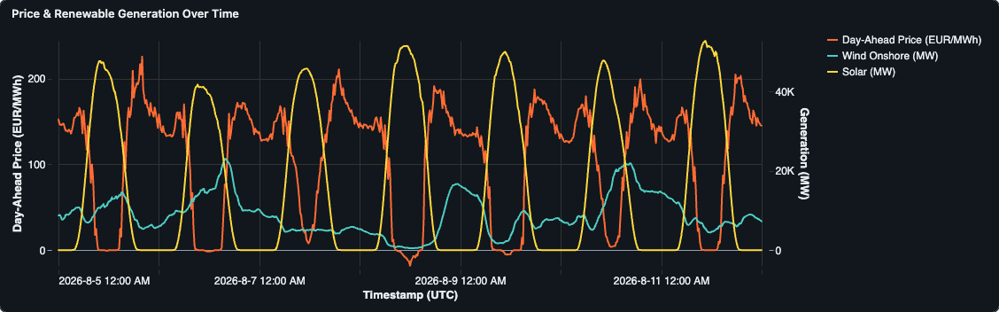
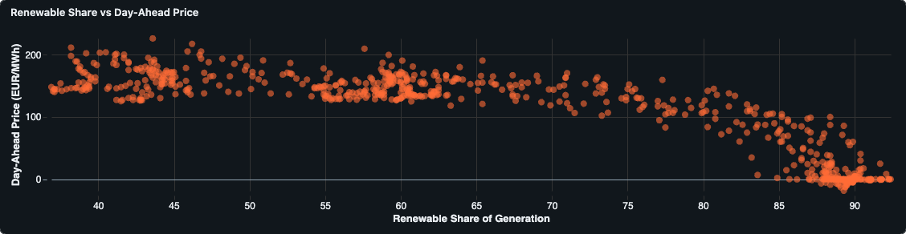
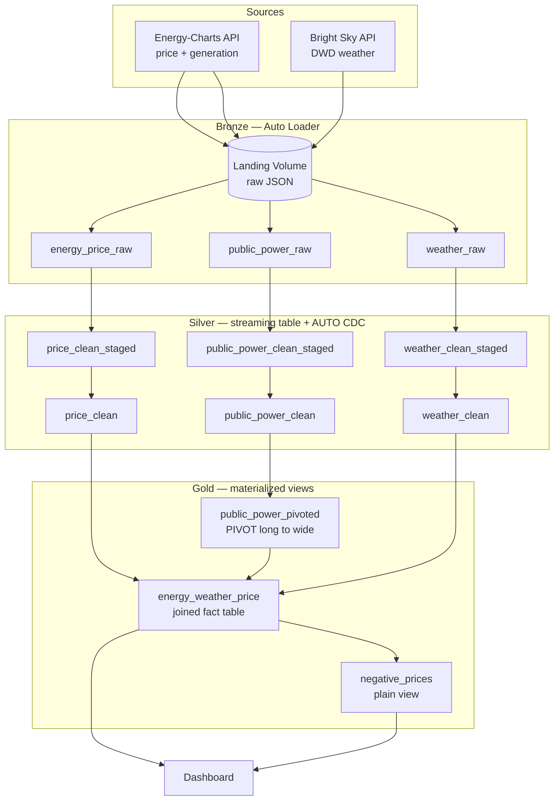
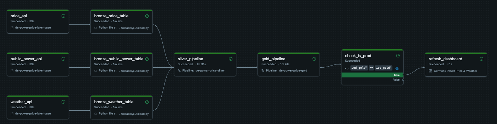
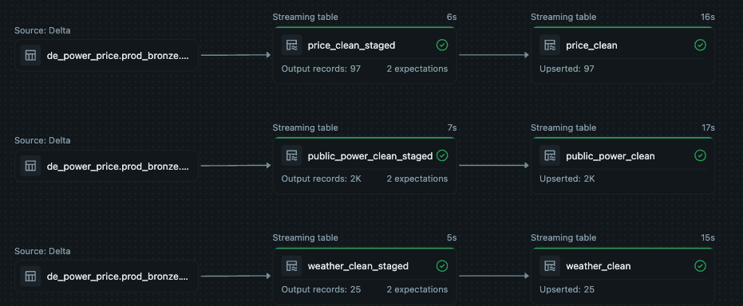
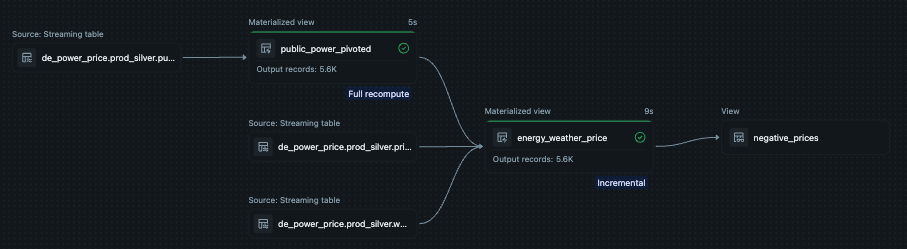
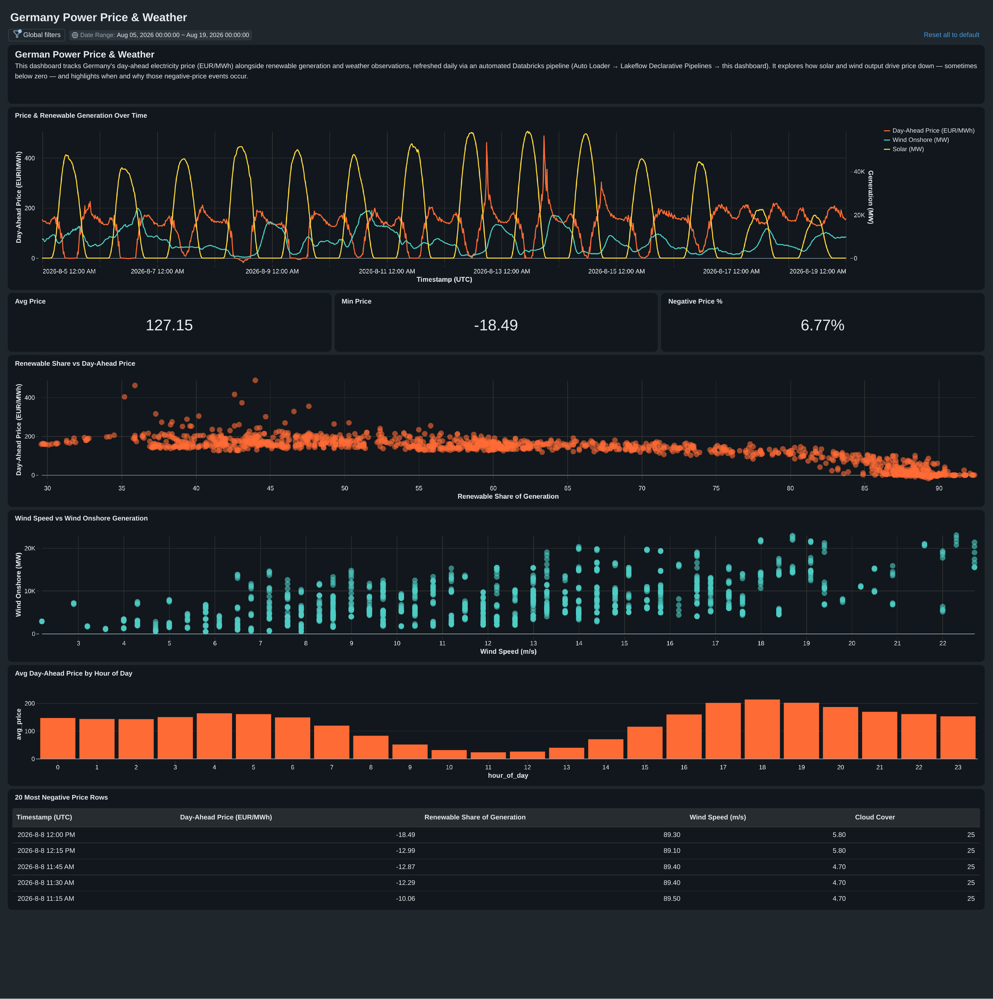
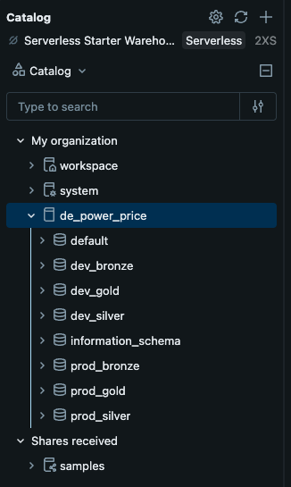

# German Power Price Lakehouse

**An end-to-end data engineering project built on Databricks — from infrastructure provisioning to an analytical dashboard.**

This project demonstrates how to build and deploy a reproducible, production-oriented data pipeline on Databricks.

**Public APIs → Unity Catalog Volumes → Auto Loader → Silver streaming/CDC pipeline → Gold analytical models → Dashboard**

The entire workflow is orchestrated by a **Lakeflow Job**, deployed to dev and prod with **Databricks Asset Bundles**, and provisioned with **Terraform**. Once the infrastructure and bundle are deployed, the complete pipeline runs without manual intervention.

## Live results

The panels below are pulled directly from the dashboard and show the core relationship this project set out to measure: as renewable output rises, the day-ahead price falls — and drops below zero at the extremes.



*Day-ahead price tracking against solar and wind onshore generation.*


*Renewable share of generation vs. day-ahead pricet.*

---

## TL;DR

- **The context:** Germany's electricity price is set a full day ahead of delivery, based on the forecast energy generation mix — and it can drop below zero when the output from renewable sources floods the grid. This project builds a full, production-shaped data pipeline on real energy market, power generation, and weather data to quantify that relationship: how price moves with the energy mix, and under what conditions it goes negative.
- **The architecture:** a real medallion lakehouse — Auto Loader ingestion with schema evolution, a **streaming table + AUTO CDC Flows** pattern for data cleanup and deduplication, gold marts in the form of **Materialized Views** for analytics, and one Lakeflow Job orchestrating the data flow from ingestion to the final dashboard.
- **The deployment:** **Terraform** for infrastructure-as-code and **Databricks Asset Bundles** for defining declarative pipelines and for environment promotion (dev/prod)
- **The constraint:** built entirely on Databricks Free Edition — no clusters, no custom catalogs, no paid features. 

--- 
## Why this project exists

This project was built as an end-to-end **data engineering exercise**: to design a realistic pipeline from infrastructure provisioning all the way to a production-style analytical product.

I wanted to demonstrate what it looks like to build a data platform **properly and reproducibly**:

* provision the infrastructure with **Terraform**
* ingest external data reliably into a **lakehouse**
* structure transformations using the **medallion architecture**
* orchestrate the complete pipeline with **Lakeflow Jobs**
* deploy the same project across **dev/prod** using Databricks Asset Bundles
* expose the resulting data through a **dashboard** 

The German electricity market provides a useful real-world dataset for this exercise: it has multiple independent data sources, time-series data, changing schemas, and interesting relationships between generation, weather, and prices. The domain is therefore the **workload**, while the primary focus of the project is the engineering behind it.


---

## Pipeline Architecture


```mermaid
flowchart TB
    subgraph Sources
        EC[Energy-Charts API<br/>price + generation]
        BS[Bright Sky API<br/>DWD weather]
    end

    subgraph "Bronze — Auto Loader"
        VOL[(Landing Volume<br/>raw JSON)]
        B1[energy_price_raw]
        B2[public_power_raw]
        B3[weather_raw]
    end

    subgraph "Silver — streaming table + AUTO CDC"
        S1S[price_clean_staged] --> S1[price_clean]
        S2S[public_power_clean_staged] --> S2[public_power_clean]
        S3S[weather_clean_staged] --> S3[weather_clean]
    end

    subgraph "Gold — materialized views"
        G1[public_power_pivoted<br/>PIVOT long to wide]
        G2[energy_weather_price<br/>joined fact table]
        G3[negative_prices<br/>plain view]
    end

    D[Dashboard]

    EC --> VOL --> B1 --> S1S
    EC --> VOL --> B2 --> S2S
    BS --> VOL --> B3 --> S3S
    S2 --> G1
    S1 --> G2
    G1 --> G2
    S3 --> G2
    G2 --> G3
    G2 --> D
    G3 --> D
```


**One Lakeflow Job:** `python_wheel_task` (API extraction) → `spark_python_task` (Auto Loader ingestion) → `pipeline_task` x2 (silver, then gold) → `condition_task` (is this prod?) → `dashboard_task` (refresh, prod only). A separate, parameter-driven **backfill job** handles historical loads without touching the daily schedule.



*The full DAG: API extraction, Auto Loader ingestion, silver, gold, and a conditional dashboard refresh.*



*Silver layer: staged streaming tables feeding AUTO CDC flows — achieves deduplication while preserving incremental updates, avoiding full refreshes.*



*Gold layer: analytics tables - join and aggregate data from upstream tables into Materialized Views.*


## Dashboard

Live panels include price vs. renewable generation over time, renewable share vs. price correlation, average price by hour of day, and a drill-down table of the most negative price events with their weather context. Refreshed automatically as the last step of the production pipeline run.



## Design choices

The reasoning behind some of the design choices made in this project are documented in [docs/decisions.md](docs/decisions.md).

## Data sources

| Source | Content | Access |
|---|---|---|
| [Energy-Charts API](https://api.energy-charts.info/) (Fraunhofer ISE) | Generation by production type, day-ahead price for the DE-LU bidding zone | Public REST, no key, CC BY 4.0 |
| [Bright Sky](https://brightsky.dev/) | Hourly weather from Germany's national weather service (DWD) | Public REST, no key |


## Infrastructure

Terraform provisions the stable foundations (schemas, landing volumes, etc.); the Asset Bundle owns everything that changes with code (jobs, pipelines, dashboard). See **[infra/README.md](infra/README.md)** for the full Terraform walkthrough.




## Repository structure

```
.
├── databricks.yml              # bundle root: dev/prod targets
├── variables.yml                # catalog + schema variables
├── infra/terraform/             # schemas, volumes — see infra/README.md
├── resources/
│   ├── daily_pipeline.yml       # the main scheduled job
│   ├── backfill_pipeline.yml    # manual, parameterized backfill job
│   ├── pipelines.yml            # silver + gold Lakeflow Pipeline definitions
│   └── dashboards.yml
├── src/de_power_price/
│   ├── api/                     # Energy-Charts + Bright Sky extraction clients
│   ├── autoloader/               # reusable Auto Loader ingestion script
│   ├── silver/                   # staged streaming tables + AUTO CDC flows
│   └── gold/                     # pivot + fact table + negative-price view
├── tests/                        # pytest — unit + fixture-based
├── docs/decisions.md             # design decisions 
└── .devcontainer/                # reproducible dev environment — see DEVELOPMENT.md
```


## Documentation map

- **[infra/README.md](infra/README.md)** — Terraform: what it provisions, how to run it
- **[docs/decisions.md](docs/decisions.md)** — reasoning behind some design choices.
- **[.devcontainer/DEVELOPMENT.md](.devcontainer/DEVELOPMENT.md)** — local setup, running tests, deploying the bundle, triggering a backfill


## Acknowledgments

Data from Fraunhofer ISE's [Energy-Charts](https://api.energy-charts.info/) and the German Weather Service (DWD) via [Bright Sky](https://brightsky.dev/).