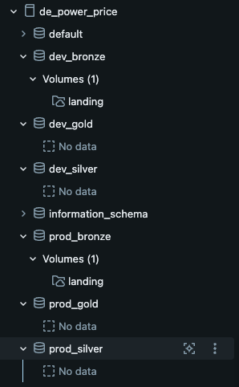

# How to provision the infrastructure

1. Create a free account on Databricks
2. Install the Databricks CLI (available in the devcontainer) and Authenticate against Databricks by running 
```bash
    databricks auth login --host <url-to-your-databricks-instance>
```
This will create ~/.databrickscfg and write your credentials and profile to it (free for the free tier).
3. Initialize Terraform:
Terraform is already installed in the devcontainer. To initalize, run the following command in the infra/terraform directory.
```bash
terraform init 
```
Terraform will load the require_providers block from versions.tf and download the "databricks/databricks" plugin from the Terraform registry into a hidden .terraform/ directory.

The Databricks plugin loads the provider information from the providers.tf file, sees the profile set to "free" and checks the ~/.databrickscfg file for the corresponding section where the workspace URL and credemtoaös are stored.

4. Workaround due to Databricks' Free edition limitation: create a catalog in the Databricks UI
Databricks' Free tier doesn't create a dedicated maetastore for your workspace. Terraform can't create catalogs on the shared metastore. In order to isolate this project's assets, create a catalog in the Databricks UI and write it to 
infra/terraform/terraform.tfvars.
e.g.
```text
catalog_name = "de_power_price"
```

4. Plan and apply changes

To plan changes based on the local state of the Terraform files, run:
```bash
terraform plan
```
Terraform will then:
    1- Read your files to get the desired state.
    2- Read the state file (terraform.tfstate), which is Terraform's record of what it created earlier.
    3- Ask the Databricks API what actually exists (a refresh).
    4- Diff desired against actual, and show the result in terraform plan: + create, ~ change, - destroy.

Inspect the planned changes before applying with 
```bash
terraform apply
```

After your changes have been applied, your Catalog Explorer should like similar to 

